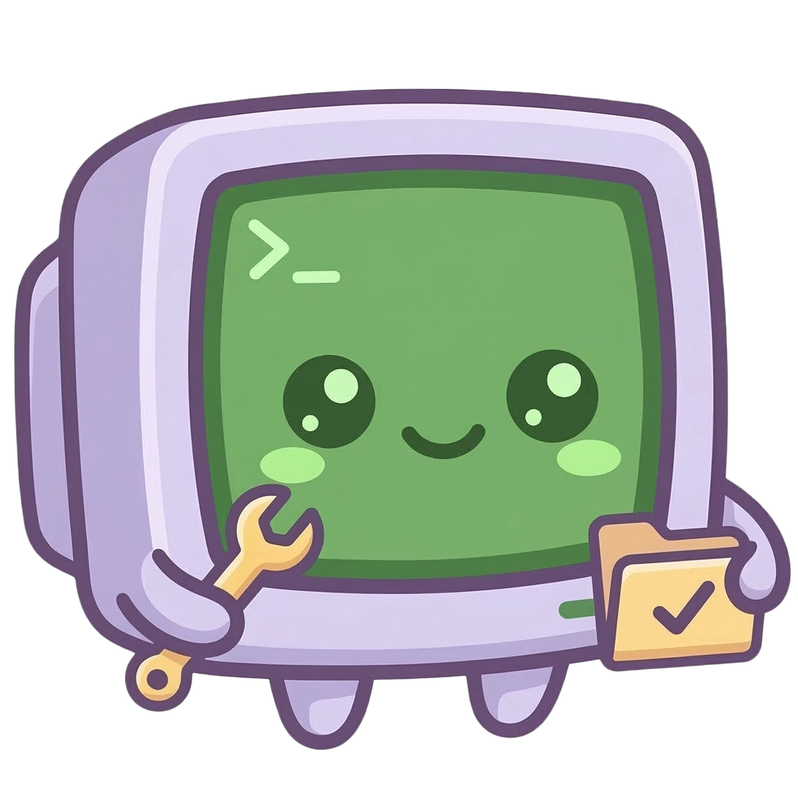
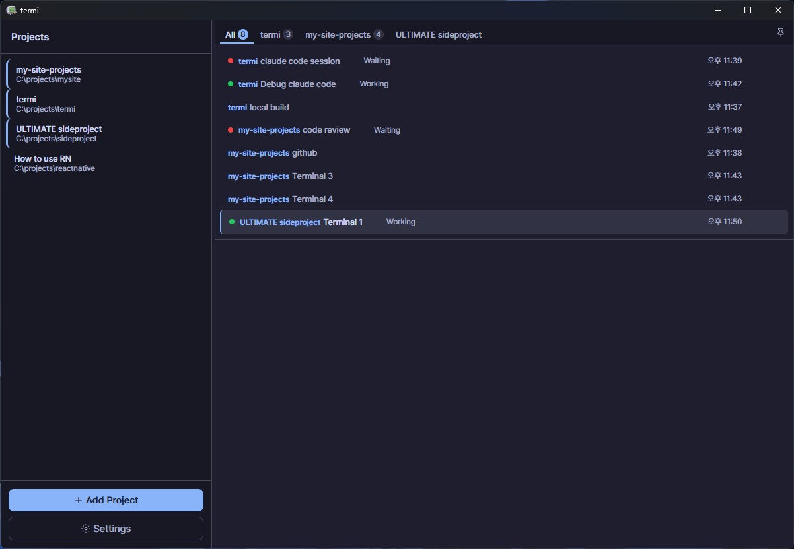
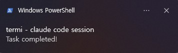
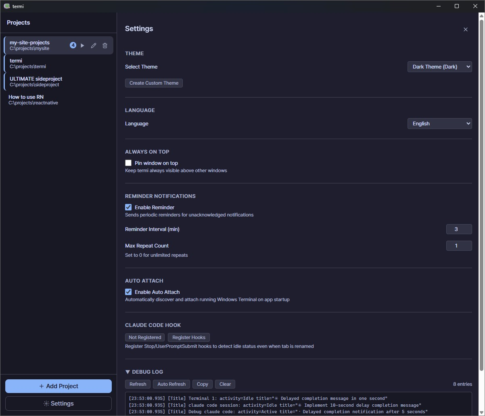
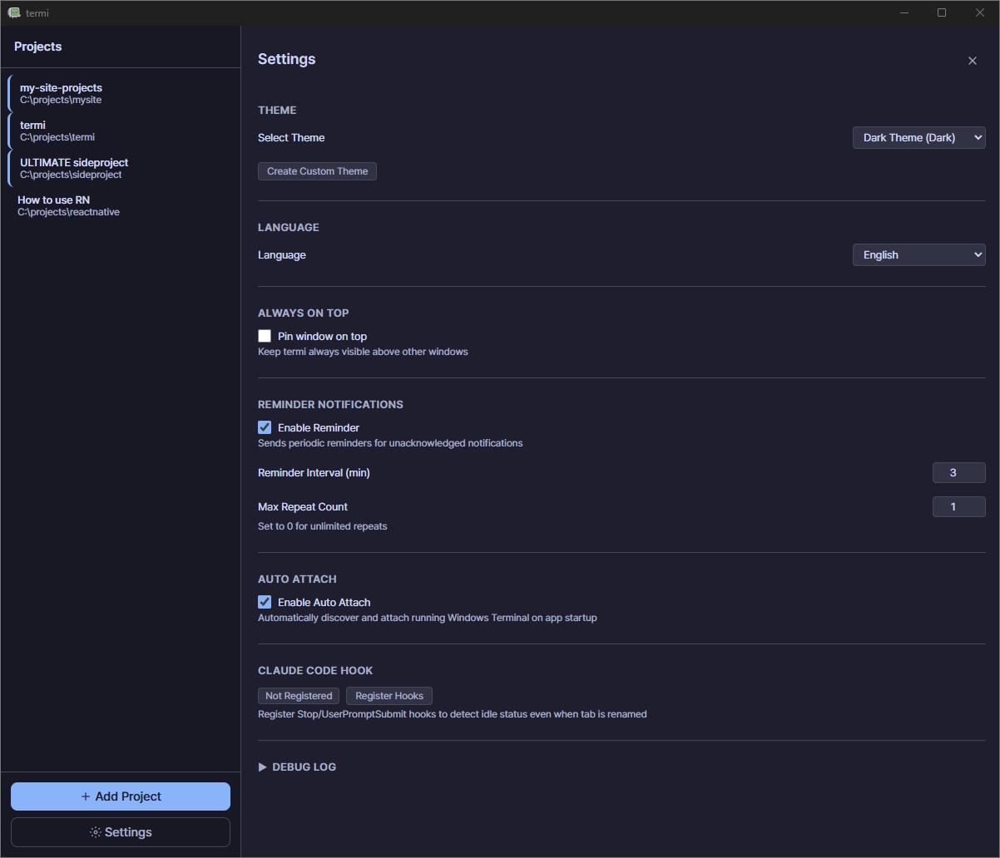
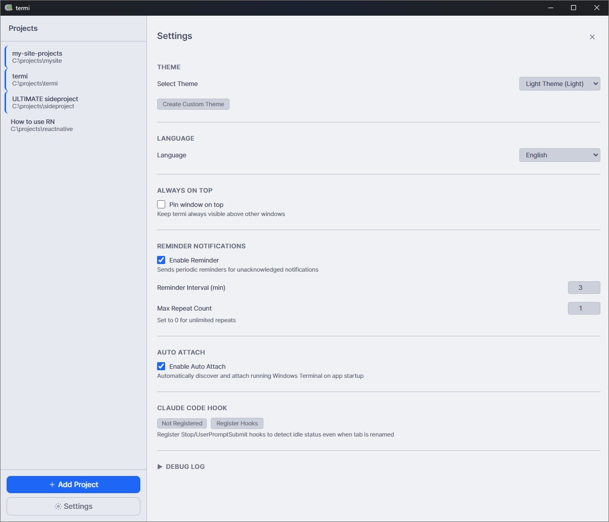
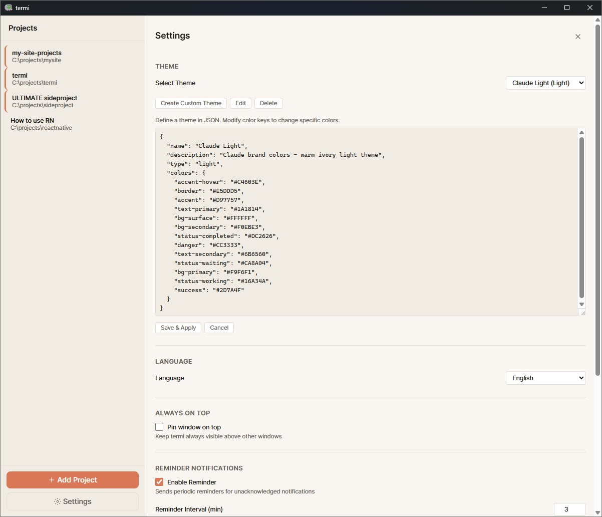

<div align="center">



# termi

### Because I f*cking love Windows Terminal.

A desktop companion app that monitors your Windows Terminal sessions,<br>
detects when **Claude Code** finishes working, and notifies you instantly.

**Built with Tauri + Svelte + Rust** | Windows only

[Features](#features) · [How It Works](#how-it-works) · [Getting Started](#getting-started) · [Detection Logic](#detection-logic) · [Claude Code Integration](#claude-code-integration)



</div>

---

## The Problem

You're a developer. You run Claude Code in Windows Terminal. You kick off a task, switch to your browser, check Slack, read docs... and then forget. Five minutes later you realize Claude has been sitting idle, waiting for your input.

Now multiply that by five terminals across three projects. That's the real power of Termi — **parallel workflow management**. Run Claude Code in multiple terminals simultaneously, and Termi watches all of them. Whenever any session finishes, you get pinged instantly. No more context-switching tax.

**Termi fixes that.**

## Features

### Terminal Session Management
- **Launch terminals per project** — one click opens Windows Terminal in your project directory
- **Track all sessions** in a clean sidebar with real-time status badges
- **Rename, reorder, close** terminals from a single dashboard
- **Tab order sync** — Termi automatically detects when you reorder tabs in Windows Terminal via UI Automation
- **Always on Top** mode — pin Termi above your other windows

### Idle Detection & Notifications
- **Automatic idle detection** — knows when Claude Code is done and waiting for you
- **Windows native toast notifications** — non-intrusive popups when a task completes
- **Click to focus** — click a notification or terminal card to instantly bring that Windows Terminal tab to the foreground
- **Persistent reminders** — still forgot? Termi re-notifies you every N minutes (configurable interval, max repeat count) until you respond
- **Per-terminal toggle** — enable/disable notifications for individual sessions

### External Terminal Support
- **Discover** already-running Windows Terminal windows
- **Attach** external tabs to Termi without interrupting your workflow
- **Import** tabs from other WT windows into your managed workspace

### Project Organization
- **Drag-and-drop reordering** — arrange projects in your preferred order
- **Per-project terminal grouping** — filter terminals by project tab
- **Debug log viewer** — real-time monitoring logs for troubleshooting detection

### Customization
- **Dark & Light themes** with full custom theme support (JSON-based)
- **English & Korean** localization (UI + notifications)
- **Configurable idle threshold**, reminder intervals, and repeat limits

### Toast Notification


### Settings & Hook Registration


### Themes
| Dark | Light | Custom (Claude Light) |
|------|-------|----------------------|
|  |  |  |

## How It Works

```
┌─────────────────────────────────────────────────────┐
│  Windows Terminal                                    │
│  ┌───────────┐ ┌───────────┐ ┌───────────┐         │
│  │ Project A │ │ Project B │ │ Project C │  ← tabs  │
│  └───────────┘ └───────────┘ └───────────┘         │
│  $ claude "refactor the auth module"                │
│  ⠿ Working...                                       │
│  ✳ Done — waiting for input                         │
└─────────────────────────────────────────────────────┘
        │
        │  ✳ detected / hook event fired
        ▼
┌─────────────────────────────────────────────────────┐
│  Termi                                              │
│                                                     │
│  Project A                                          │
│    Terminal 1  ● Active (working)                   │
│    Terminal 2  ○ Idle   (done!)  ← 🔔 notification  │
│                                                     │
│  Project B                                          │
│    Terminal 1  ○ Idle   (done!)  ← 🔔 notification  │
└─────────────────────────────────────────────────────┘
```

1. You register your projects in Termi
2. Launch terminals — Termi opens Windows Terminal in your project folder
3. Run Claude Code (or any long-running task)
4. **Termi detects when the terminal goes idle** and sends you a toast notification
5. Click the notification or Termi's dashboard to jump straight to that terminal

## Detection Logic

Termi uses **two independent detection mechanisms** that work together for maximum reliability:

### Method 1: Title Marker Detection (✳)

Claude Code appends a star marker `✳` to the terminal tab title when it finishes a task and is waiting for input.

```
Working:  "termi: Project A"
Idle:     "termi: Project A ✳"
```

Termi's monitoring thread polls every second using **Windows UI Automation (UIA)** to read individual tab titles — even when multiple tabs share one window. When `✳` appears, the terminal is marked idle. When it disappears for 3+ seconds (debounced), it's marked active again.

**Pros:** Zero setup, works out of the box.
**Limitation:** If you rename the terminal tab, the marker can't be detected.

### Method 2: Claude Code Hooks (Recommended)

Termi registers a PowerShell hook directly into Claude Code's event system:

```json
// ~/.claude/settings.json (auto-configured by Termi)
{
  "hooks": {
    "Stop": [{ "command": "powershell ... termi-hook.ps1" }],
    "UserPromptSubmit": [{ "command": "powershell ... termi-hook.ps1" }]
  }
}
```

| Event | Meaning | Termi Action |
|-------|---------|-------------|
| `Stop` | Claude finished, shell is idle | Mark terminal **Idle** → notify |
| `UserPromptSubmit` | User typed a new prompt | Mark terminal **Active** |

The hook script captures `session_id` and `cwd` from Claude Code, writes an event file, and Termi's EventWatcher picks it up in real-time.

**Pros:** Works even if you rename the tab title. More accurate. Instant detection.
**Setup:** One click in Settings → Hooks → Register.

### Why Both?

| Scenario | ✳ Marker | Hook |
|----------|----------|------|
| Default tab title | ✅ | ✅ |
| Renamed tab title | ❌ | ✅ |
| Claude Code not installed | N/A | N/A |
| Hook not registered | ✅ | ❌ |
| Multiple tabs per window | ✅ (via UIA) | ✅ |

**Use both for bulletproof detection.** Termi will use whichever signal arrives first.

## Claude Code Integration

Termi is purpose-built as a **companion tool for [Claude Code](https://docs.anthropic.com/en/docs/claude-code)**.

- **One-click hook registration** — Termi writes the hook config to `~/.claude/settings.json` with backup
- **Session tracking** — maps Claude Code sessions to specific terminal tabs via `session_id`
- **Smart matching** — when a new session starts, Termi matches it to the right terminal by project path
- **Priority system** — renamed tabs (can't use ✳) get hook-matched first

You don't need Claude Code to use Termi — the ✳ marker detection works with any process that modifies the terminal title. But Claude Code integration is where Termi truly shines.

## Getting Started

### Prerequisites
- **Windows 10/11**
- **Windows Terminal** (from Microsoft Store or GitHub)
- **Claude Code** (optional, for hook-based detection)

### Install

Download the latest installer from [Releases](../../releases):
- `termi_x.x.x_x64-setup.exe` (NSIS installer)
- `termi_x.x.x_x64_en-US.msi` (MSI installer)

### Quick Start

1. **Add a project** — click "Add Project" in the sidebar, pick a folder
2. **Launch a terminal** — click ▶ to open Windows Terminal in that directory
3. **Register hooks** (recommended) — go to Settings → Hooks → Register
4. **Start coding** — run Claude Code, switch away, and Termi will ping you when it's done

### Build from Source

```bash
# Prerequisites: Node.js, Rust, Windows SDK
git clone https://github.com/hojeongna/termi.git
cd termi
npm install
npm run tauri dev    # development
npm run tauri build  # production
```

## Tech Stack

| Layer | Technology |
|-------|-----------|
| Framework | [Tauri v2](https://tauri.app) |
| Frontend | [Svelte 5](https://svelte.dev) + TypeScript |
| Backend | Rust |
| Notifications | WinRT Toast Notifications |
| Tab Detection | Windows UI Automation API |
| Styling | Custom CSS with theme system |

## Roadmap

- [ ] Custom detection rules
- [ ] Statistics dashboard (idle time, session duration)
- [ ] Plugin system for other AI coding tools

## License

MIT

---

<div align="center">

**Built with frustration and love for Windows Terminal.**

For every Windows developer who deserves better tooling.<br>
This one's for you.

</div>
